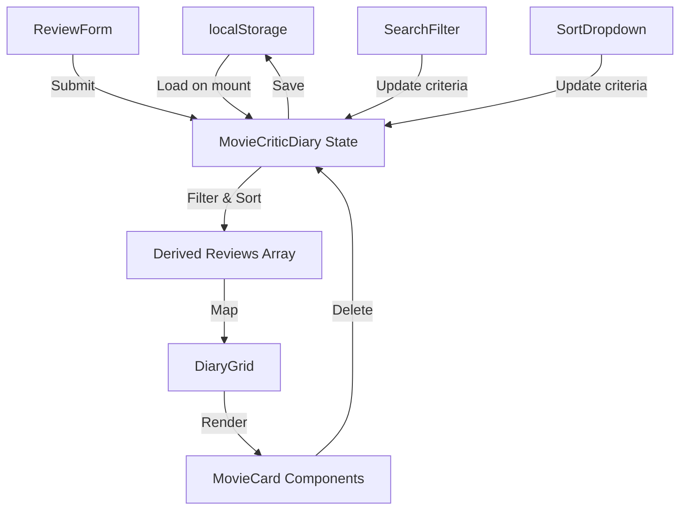

# Design Document: Personal Movie Critic Diary

## Overview

The Personal Movie Critic Diary is a single-page React application that enables users to create, manage, and browse movie reviews with a cyberpunk-inspired aesthetic. The application leverages React's functional component architecture with hooks for state management and browser localStorage for data persistence.

The core user experience centers around three primary interactions:
1. Creating movie reviews with ratings, images, and commentary
2. Browsing reviews in a responsive grid layout
3. Filtering and sorting reviews to find specific entries

The application is built using Vite as the build tool and follows modern React patterns with functional components and hooks. All data persists locally in the browser, requiring no backend infrastructure.

## Architecture

### Component Hierarchy

```
App (Root)
└── MovieCriticDiary (Main Container)
    ├── ReviewForm
    │   └── StarRating
    ├── SearchFilter
    ├── SortDropdown
    └── DiaryGrid
        └── MovieCard (multiple instances)
```

### State Management Strategy

The application uses a centralized state management approach within the `MovieCriticDiary` component:

- **Primary State**: `reviews` array stored in `useState`, containing all Review_Entry objects
- **Derived State**: Filtered and sorted reviews computed on each render based on search and sort criteria
- **Form State**: Local state within `ReviewForm` for input fields
- **Rating State**: Local state within `StarRating` for hover and selection effects

State flows unidirectionally from parent to child components via props, with event handlers passed down to enable child-to-parent communication.

### Data Flow



### localStorage Integration Pattern

The application implements a synchronization pattern between React state and localStorage:

1. **Initial Load**: `useEffect` with empty dependency array reads from localStorage on mount
2. **Persistence**: `useEffect` with `reviews` dependency writes to localStorage on every state change
3. **Serialization**: JSON.stringify/parse handles conversion between JavaScript objects and storage strings
4. **Key**: Single localStorage key `movieReviews` stores the entire reviews array

This pattern ensures automatic persistence without requiring explicit save actions from users.

## Components and Interfaces

### MovieCriticDiary (Main Container)

**Responsibilities**:
- Manage global application state (reviews array, search term, sort option)
- Coordinate data flow between child components
- Handle localStorage synchronization
- Compute filtered and sorted review lists

**State**:
```javascript
const [reviews, setReviews] = useState([])
const [searchTerm, setSearchTerm] = useState('')
const [sortOption, setSortOption] = useState('newest')
```

**Key Methods**:
- `addReview(reviewData)`: Adds new review to state and triggers localStorage save
- `deleteReview(reviewId)`: Removes review from state and triggers localStorage save
- `filterReviews()`: Returns reviews matching search term (case-insensitive partial match)
- `sortReviews(filteredReviews)`: Returns sorted array based on current sort option

**Props Interface**: None (root component)

### ReviewForm

**Responsibilities**:
- Collect user input for new movie reviews
- Validate form completeness before enabling submission
- Clear form after successful submission
- Integrate StarRating component for rating input

**State**:
```javascript
const [title, setTitle] = useState('')
const [imageUrl, setImageUrl] = useState('')
const [reviewText, setReviewText] = useState('')
const [rating, setRating] = useState(0)
```

**Props Interface**:
```javascript
{
  onSubmit: (reviewData) => void
}
```

**Validation Logic**:
- Submit button disabled when: `!title || !imageUrl || !reviewText || rating === 0`
- All fields required before submission

**Event Handlers**:
- `handleSubmit(e)`: Prevents default, creates Review_Entry object with timestamp, calls `onSubmit`, clears form

### StarRating

**Responsibilities**:
- Display 10 interactive star icons
- Handle hover effects for visual feedback
- Capture user rating selection
- Display current rating value numerically

**State**:
```javascript
const [hoverRating, setHoverRating] = useState(0)
```

**Props Interface**:
```javascript
{
  rating: number,           // Current selected rating (0-10)
  onRatingChange: (rating) => void
}
```

**Interaction Logic**:
- On hover: Highlight stars 1 through hovered position in yellow (#FFD700)
- On click: Set rating to clicked star position
- On mouse leave: Reset hover state, show only selected rating
- Display format: "★★★★★★★★★★ 8/10"

### SearchFilter

**Responsibilities**:
- Provide text input for search queries
- Emit search term changes to parent component
- Display current search term

**State**: None (controlled component)

**Props Interface**:
```javascript
{
  searchTerm: string,
  onSearchChange: (term) => void
}
```

**Behavior**:
- Real-time filtering as user types
- Case-insensitive matching
- Partial string matching against movie titles

### SortDropdown

**Responsibilities**:
- Display sort options in dropdown menu
- Emit sort option changes to parent component
- Show currently selected sort option

**State**: None (controlled component)

**Props Interface**:
```javascript
{
  sortOption: string,       // 'newest' | 'highest'
  onSortChange: (option) => void
}
```

**Sort Options**:
- "Newest Date": Sort by timestamp descending
- "Highest Rated": Sort by rating descending

### DiaryGrid

**Responsibilities**:
- Layout MovieCard components in responsive grid
- Handle empty state display
- Maintain consistent spacing

**Props Interface**:
```javascript
{
  reviews: Array<ReviewEntry>,
  onDelete: (reviewId) => void
}
```

**Layout Behavior**:
- CSS Grid with responsive column counts
- Gap spacing: 24px between cards
- Empty state message when no reviews match filters

### MovieCard

**Responsibilities**:
- Display single review with all details
- Handle image loading errors with placeholder
- Provide delete functionality
- Apply cyberpunk theme styling

**Props Interface**:
```javascript
{
  review: ReviewEntry,
  onDelete: (reviewId) => void
}
```

**Display Elements**:
- Movie poster image (with error handling)
- Movie title (heading)
- Star rating badge
- Review text content
- Delete button

**Error Handling**:
- Image load failure: Display placeholder with movie title text
- Placeholder background: Dark gray with yellow border

## Data Models

### Review_Entry

The core data structure representing a single movie review:

```javascript
{
  id: string,              // Unique identifier (timestamp-based or UUID)
  title: string,           // Movie title
  imageUrl: string,        // URL to movie poster image
  rating: number,          // Rating value (1-10)
  reviewText: string,      // User's review commentary
  timestamp: number        // Unix timestamp (Date.now())
}
```

**Validation Rules**:
- `id`: Must be unique across all reviews
- `title`: Non-empty string, trimmed
- `imageUrl`: Non-empty string (URL format not validated)
- `rating`: Integer between 1 and 10 inclusive
- `reviewText`: Non-empty string, trimmed
- `timestamp`: Positive integer representing milliseconds since epoch

**Storage Format**:
```javascript
// localStorage key: 'movieReviews'
// Value: JSON stringified array of Review_Entry objects
[
  { id: "1234567890", title: "Blade Runner", ... },
  { id: "1234567891", title: "Akira", ... }
]
```

## Correctness Properties


*A property is a characteristic or behavior that should hold true across all valid executions of a system—essentially, a formal statement about what the system should do. Properties serve as the bridge between human-readable specifications and machine-verifiable correctness guarantees.*

### Property 1: Review Creation Persistence

*For any* valid Review_Entry object, when it is created through the ReviewForm, it should immediately appear in localStorage under the 'movieReviews' key.

**Validates: Requirements 1.1**

### Property 2: Review Deletion Persistence

*For any* Review_Entry in the collection, when it is deleted, it should be removed from both the application state and localStorage, with localStorage reflecting the updated collection.

**Validates: Requirements 1.2, 8.2**

### Property 3: Application Load Retrieval

*For any* set of Review_Entry objects stored in localStorage, when the application loads, all stored reviews should be retrieved and displayed in the DiaryGrid.

**Validates: Requirements 1.3**

### Property 4: Serialization Round-Trip

*For any* valid Review_Entry object, serializing it to JSON and then deserializing it back should produce an equivalent object with all fields intact.

**Validates: Requirements 1.4, 1.5**

### Property 5: Form Validation State

*For any* form state where all required fields (title, imageUrl, reviewText, rating > 0) are completed, the submit button should be enabled; otherwise it should be disabled.

**Validates: Requirements 2.5**

### Property 6: Review Creation with Timestamp

*For any* valid form submission, a new Review_Entry should be created with all provided fields plus a timestamp, and the timestamp should be a valid Unix timestamp representing the creation time.

**Validates: Requirements 2.6**

### Property 7: Form Reset After Submission

*For any* successful review submission, all form input fields (title, imageUrl, reviewText, rating) should be cleared and reset to their initial empty/zero states.

**Validates: Requirements 2.7**

### Property 8: Star Hover Highlighting

*For any* star position (1-10) that receives a hover event, that star and all stars before it should be highlighted in yellow (#FFD700), while stars after it remain dimmed.

**Validates: Requirements 3.2**

### Property 9: Star Click Rating Selection

*For any* star position (1-10) that is clicked, the rating should be set to that position's value, and the component should display that rating both visually and numerically.

**Validates: Requirements 3.3, 3.4, 3.6**

### Property 10: Rating Update Capability

*For any* initial rating value and any different star position, clicking the new star position should update the rating to the new value, demonstrating that ratings can be changed after initial selection.

**Validates: Requirements 3.5**

### Property 11: Search Filtering with Case Insensitivity

*For any* collection of Review_Entry objects and any search term, the filtered results should include only reviews whose titles contain the search term as a substring, with matching performed case-insensitively.

**Validates: Requirements 4.2, 4.3**

### Property 12: Real-Time Search Updates

*For any* search term change, the DiaryGrid should update immediately to display the filtered results without requiring any additional user action or page refresh.

**Validates: Requirements 4.5**

### Property 13: Sort Order Correctness

*For any* collection of Review_Entry objects and any sort option (highest rated or newest date), the displayed reviews should be ordered in descending order by the selected criterion (rating or timestamp).

**Validates: Requirements 5.2, 5.3**

### Property 14: Combined Filter and Sort

*For any* collection of Review_Entry objects, search term, and sort option, the displayed reviews should be both filtered by the search term and sorted by the selected criterion, with both operations applied correctly.

**Validates: Requirements 5.4**

### Property 15: Sort Selection Display

*For any* sort option selection, the Sort_Dropdown should display the currently selected option as the visible value in the dropdown.

**Validates: Requirements 5.5**

### Property 16: MovieCard Complete Display

*For any* Review_Entry object, the rendered MovieCard should display all required fields: the poster image (or placeholder), movie title, star rating badge, and review text content.

**Validates: Requirements 6.1, 6.2, 6.3, 6.4**

### Property 17: Theme Color Application

*For any* MovieCard component, the styling should apply the cyberpunk theme with yellow (#FFD700) accents and deep black (#0D0D0D) background colors.

**Validates: Requirements 6.7**

### Property 18: Grid Spacing Consistency

*For any* viewport size, the DiaryGrid should maintain consistent spacing (24px gap) between MovieCard components.

**Validates: Requirements 7.5**

### Property 19: Review Deletion from Collection

*For any* Review_Entry in the displayed collection, when its delete button is clicked, that review should be immediately removed from the visible DiaryGrid without requiring a page refresh.

**Validates: Requirements 8.1, 8.3, 8.4**

### Property 20: Theme Consistency Across Components

*For any* component in the application, the theme colors (deep black #0D0D0D and yellow #FFD700) should be applied consistently according to the design system.

**Validates: Requirements 9.3**

### Property 21: Text Contrast for Readability

*For any* text element in the application, the contrast ratio between text color and background color should meet accessibility standards for readability (WCAG AA minimum 4.5:1 for normal text).

**Validates: Requirements 9.4**

## Error Handling

### Image Loading Failures

When a movie poster image fails to load (404, network error, invalid URL), the MovieCard component should:
- Catch the error event on the `` element using `onError` handler
- Display a placeholder div with the movie title text
- Style the placeholder with a dark gray background and yellow border to maintain theme consistency
- Ensure the card layout remains intact and properly sized

Implementation approach:
```javascript
const [imageError, setImageError] = useState(false)

 setImageError(true)}
  style={{ display: imageError ? 'none' : 'block' }}
/>
{imageError && <div className="image-placeholder">{review.title}</div>}
```

### localStorage Quota Exceeded

When localStorage reaches its storage limit (typically 5-10MB):
- Wrap localStorage operations in try-catch blocks
- Catch `QuotaExceededError` exceptions
- Display user-friendly error message suggesting deletion of old reviews
- Prevent application crash and allow continued use of existing data
- Log error to console for debugging

### Invalid JSON in localStorage

When localStorage contains corrupted or invalid JSON data:
- Wrap `JSON.parse()` in try-catch block
- Catch `SyntaxError` exceptions
- Initialize with empty array as fallback
- Log warning to console
- Allow user to start fresh with empty diary

### Empty States

When no reviews exist or search returns no results:
- DiaryGrid should display helpful message: "No reviews found. Add your first movie review!"
- For empty search results: "No movies match your search. Try a different term."
- Maintain layout structure to prevent UI jumping

### Form Validation

When users attempt to submit incomplete forms:
- Submit button remains disabled (preventive approach)
- No error messages needed since submission is prevented
- Visual feedback through disabled button state

## Testing Strategy

### Dual Testing Approach

The application requires both unit tests and property-based tests for comprehensive coverage:

**Unit Tests** focus on:
- Specific UI structure examples (form fields exist, buttons render, grid layout applied)
- Edge cases (empty search, image load failures, empty localStorage)
- Integration points (component mounting, event handler wiring)
- Responsive breakpoints (specific viewport widths: 768px, 1024px)
- Code structure validation (functional components, hooks usage, file organization)

**Property-Based Tests** focus on:
- Universal behaviors across all inputs (filtering, sorting, persistence)
- Data transformations (serialization, state updates)
- User interactions (star rating, form submission, deletion)
- Visual consistency (theme application, display completeness)

### Property-Based Testing Configuration

**Library Selection**: Use `@fast-check/vitest` for property-based testing in the Vite/Vitest environment.

**Test Configuration**:
- Minimum 100 iterations per property test to ensure comprehensive input coverage
- Each property test must include a comment tag referencing its design document property
- Tag format: `// Feature: movie-critic-diary, Property {number}: {property_text}`

**Example Property Test Structure**:
```javascript
import { test } from 'vitest'
import { fc, assert } from '@fast-check/vitest'

// Feature: movie-critic-diary, Property 4: Serialization Round-Trip
test('Review serialization round-trip preserves data', () => {
  assert.property(
    fc.record({
      id: fc.string(),
      title: fc.string({ minLength: 1 }),
      imageUrl: fc.webUrl(),
      rating: fc.integer({ min: 1, max: 10 }),
      reviewText: fc.string({ minLength: 1 }),
      timestamp: fc.integer({ min: 0 })
    }),
    (review) => {
      const serialized = JSON.stringify(review)
      const deserialized = JSON.parse(serialized)
      return JSON.stringify(deserialized) === serialized
    },
    { numRuns: 100 }
  )
})
```

### Unit Test Examples

**UI Structure Tests**:
```javascript
test('ReviewForm renders all required input fields', () => {
  render(<ReviewForm onSubmit={vi.fn()} />)
  expect(screen.getByLabelText(/title/i)).toBeInTheDocument()
  expect(screen.getByLabelText(/image url/i)).toBeInTheDocument()
  expect(screen.getByLabelText(/review/i)).toBeInTheDocument()
  expect(screen.getByRole('button', { name: /submit/i })).toBeInTheDocument()
})
```

**Edge Case Tests**:
```javascript
test('MovieCard displays placeholder when image fails to load', () => {
  const review = { title: 'Test Movie', imageUrl: 'invalid.jpg', ... }
  render(<MovieCard review={review} onDelete={vi.fn()} />)
  
  const img = screen.getByRole('img')
  fireEvent.error(img)
  
  expect(screen.getByText('Test Movie')).toBeInTheDocument()
  expect(screen.getByTestId('image-placeholder')).toBeInTheDocument()
})
```

**Responsive Breakpoint Tests**:
```javascript
test('DiaryGrid displays 3 columns on desktop', () => {
  global.innerWidth = 1200
  render(<DiaryGrid reviews={mockReviews} onDelete={vi.fn()} />)
  
  const grid = screen.getByTestId('diary-grid')
  expect(getComputedStyle(grid).gridTemplateColumns).toBe('repeat(3, 1fr)')
})
```

### Test Coverage Goals

- Unit test coverage: 80%+ for component rendering and edge cases
- Property test coverage: 100% of correctness properties (21 properties)
- Integration test coverage: Key user flows (add review, search, sort, delete)
- Visual regression testing: Theme consistency across components (optional, using tools like Chromatic)

### Testing Tools

- **Test Runner**: Vitest (integrated with Vite)
- **Component Testing**: @testing-library/react
- **Property-Based Testing**: @fast-check/vitest
- **Mocking**: vitest mocking utilities for localStorage
- **Coverage**: vitest coverage reporter (c8)
