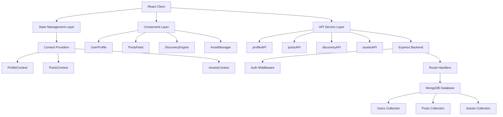
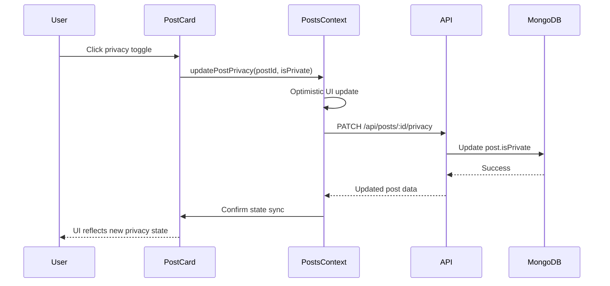

# Design Document: Social Media Dashboard

## Overview

The Social Media Dashboard is a comprehensive React-based feature that enables users to create personalized profiles, manage content privacy, discover other users through interest-based recommendations, and handle media assets through an intuitive drag-and-drop interface. The system implements immediate state synchronization for privacy changes, a sophisticated matching algorithm for user discovery, and a full-featured asset management system with CRUD operations. Built on React with MongoDB for data persistence, the architecture emphasizes modular components, centralized state management, and RESTful API design patterns consistent with the existing application structure.

## Architecture



## Main Workflow: Privacy Toggle




## Components and Interfaces

### Component 1: UserProfile

**Purpose**: Displays and manages user profile information including avatar, bio, privacy settings, and interest tags.

**Interface**:
```typescript
interface UserProfileProps {
  userId: string;
  isOwnProfile: boolean;
}

interface UserProfileData {
  id: string;
  username: string;
  avatar: string | null;
  bio: string;
  isPrivate: boolean;
  interestTags: string[];
  createdAt: Date;
  updatedAt: Date;
}

interface ProfileAPI {
  getProfile(userId: string): Promise<UserProfileData>;
  updateProfile(userId: string, data: Partial<UserProfileData>): Promise<UserProfileData>;
  uploadAvatar(userId: string, file: File): Promise<{ avatarUrl: string }>;
}
```

**Responsibilities**:
- Render user profile information with avatar, bio, and metadata
- Handle profile editing mode with form validation
- Manage privacy toggle with immediate UI feedback
- Display interest tags as interactive chips
- Handle avatar upload with preview functionality

### Component 2: PostsFeed

**Purpose**: Displays a feed of posts with privacy controls and filtering capabilities.

**Interface**:
```typescript
interface PostsFeedProps {
  userId?: string;
  filterPrivate?: boolean;
}

interface Post {
  id: string;
  userId: string;
  content: string;
  imageUrls: string[];
  isPrivate: boolean;
  createdAt: Date;
  updatedAt: Date;
}

interface PostsAPI {
  getPosts(userId?: string, includePrivate?: boolean): Promise<Post[]>;
  createPost(data: CreatePostData): Promise<Post>;
  updatePostPrivacy(postId: string, isPrivate: boolean): Promise<Post>;
  deletePost(postId: string): Promise<void>;
}
```

**Responsibilities**:
- Render paginated list of posts with lazy loading
- Implement privacy toggle with optimistic UI updates
- Filter posts based on privacy settings and user permissions
- Handle post creation with media attachments
- Provide delete confirmation dialogs


### Component 3: DiscoveryEngine

**Purpose**: Recommends users based on shared interest tags using a matching algorithm.

**Interface**:
```typescript
interface DiscoveryEngineProps {
  currentUserId: string;
  maxSuggestions?: number;
}

interface SuggestedUser {
  id: string;
  username: string;
  avatar: string | null;
  bio: string;
  sharedInterests: string[];
  matchScore: number;
}

interface DiscoveryAPI {
  getSuggestedUsers(userId: string, limit?: number): Promise<SuggestedUser[]>;
  getMatchScore(userId1: string, userId2: string): Promise<number>;
}
```

**Responsibilities**:
- Calculate match scores based on shared interest tags
- Rank suggested users by relevance
- Display user cards with shared interests highlighted
- Handle "follow" or "connect" actions
- Refresh suggestions based on user interactions

### Component 4: AssetManager

**Purpose**: Provides a comprehensive interface for uploading, organizing, and managing user media assets.

**Interface**:
```typescript
interface AssetManagerProps {
  userId: string;
  mode: 'upload' | 'library';
}

interface Asset {
  id: string;
  userId: string;
  url: string;
  caption: string;
  order: number;
  uploadedAt: Date;
}

interface AssetAPI {
  uploadAssets(files: File[]): Promise<Asset[]>;
  getAssets(userId: string): Promise<Asset[]>;
  updateAsset(assetId: string, data: Partial<Asset>): Promise<Asset>;
  deleteAssets(assetIds: string[]): Promise<void>;
  reorderAssets(assetIds: string[]): Promise<Asset[]>;
}
```

**Responsibilities**:
- Implement drag-and-drop zone using react-dropzone
- Display asset library in grid layout with edit mode
- Handle batch selection for deletion
- Provide inline caption editing
- Support drag-to-reorder functionality
- Show upload progress indicators


## Data Models

### Model 1: User

```typescript
interface User {
  _id: string;
  username: string;
  email: string;
  passwordHash: string;
  avatar: string | null;
  bio: string;
  isPrivate: boolean;
  interestTags: string[];
  createdAt: Date;
  updatedAt: Date;
}
```

**MongoDB Schema**:
```javascript
{
  username: { type: String, required: true, unique: true, index: true },
  email: { type: String, required: true, unique: true },
  passwordHash: { type: String, required: true },
  avatar: { type: String, default: null },
  bio: { type: String, default: '', maxlength: 500 },
  isPrivate: { type: Boolean, default: false },
  interestTags: [{ type: String, lowercase: true, trim: true }],
  createdAt: { type: Date, default: Date.now },
  updatedAt: { type: Date, default: Date.now }
}
```

**Validation Rules**:
- username: 3-30 characters, alphanumeric and underscores only
- email: valid email format
- bio: maximum 500 characters
- interestTags: array of 1-20 tags, each 2-30 characters
- avatar: valid URL or null

### Model 2: Post

```typescript
interface Post {
  _id: string;
  userId: string;
  content: string;
  imageUrls: string[];
  isPrivate: boolean;
  createdAt: Date;
  updatedAt: Date;
}
```

**MongoDB Schema**:
```javascript
{
  userId: { type: Schema.Types.ObjectId, ref: 'User', required: true, index: true },
  content: { type: String, required: true, maxlength: 5000 },
  imageUrls: [{ type: String }],
  isPrivate: { type: Boolean, default: false, index: true },
  createdAt: { type: Date, default: Date.now, index: true },
  updatedAt: { type: Date, default: Date.now }
}
```

**Validation Rules**:
- content: 1-5000 characters, required
- imageUrls: array of 0-10 valid URLs
- isPrivate: boolean, defaults to false
- userId: must reference existing user


### Model 3: Asset

```typescript
interface Asset {
  _id: string;
  userId: string;
  url: string;
  caption: string;
  order: number;
  uploadedAt: Date;
}
```

**MongoDB Schema**:
```javascript
{
  userId: { type: Schema.Types.ObjectId, ref: 'User', required: true, index: true },
  url: { type: String, required: true },
  caption: { type: String, default: '', maxlength: 200 },
  order: { type: Number, default: 0 },
  uploadedAt: { type: Date, default: Date.now, index: true }
}
```

**Validation Rules**:
- url: valid URL, required
- caption: maximum 200 characters
- order: non-negative integer for sorting
- userId: must reference existing user

## Key Functions with Formal Specifications

### Function 1: calculateMatchScore()

```typescript
function calculateMatchScore(
  userInterests: string[],
  targetInterests: string[]
): number
```

**Preconditions:**
- `userInterests` is a non-null array of strings
- `targetInterests` is a non-null array of strings
- Both arrays contain lowercase, trimmed strings

**Postconditions:**
- Returns a number between 0 and 1 (inclusive)
- Score of 0 indicates no shared interests
- Score of 1 indicates identical interest sets
- Score is calculated as: (shared interests count) / (total unique interests count)

**Loop Invariants:** N/A (uses Set operations)

### Function 2: updatePostPrivacyOptimistic()

```typescript
function updatePostPrivacyOptimistic(
  postId: string,
  isPrivate: boolean,
  posts: Post[]
): Post[]
```

**Preconditions:**
- `postId` is a valid non-empty string
- `isPrivate` is a boolean value
- `posts` is a non-null array of Post objects
- Post with `postId` exists in the `posts` array

**Postconditions:**
- Returns new array with updated post privacy
- Original `posts` array remains unchanged (immutability)
- Only the specified post's `isPrivate` field is modified
- All other post properties remain unchanged
- Array length remains the same

**Loop Invariants:** N/A (uses array map)


### Function 3: validateAssetUpload()

```typescript
function validateAssetUpload(
  files: File[],
  maxSize: number,
  allowedTypes: string[]
): { valid: File[], invalid: { file: File, reason: string }[] }
```

**Preconditions:**
- `files` is a non-null array of File objects
- `maxSize` is a positive integer (bytes)
- `allowedTypes` is a non-empty array of MIME type strings

**Postconditions:**
- Returns object with `valid` and `invalid` arrays
- Sum of lengths of `valid` and `invalid` equals `files.length`
- All files in `valid` meet size and type requirements
- All files in `invalid` have associated reason strings
- No file appears in both arrays

**Loop Invariants:**
- For each iteration: processed files are correctly categorized
- Total count of categorized files equals iteration index

### Function 4: reorderAssets()

```typescript
function reorderAssets(
  assets: Asset[],
  draggedId: string,
  targetIndex: number
): Asset[]
```

**Preconditions:**
- `assets` is a non-null array of Asset objects
- `draggedId` exists in the assets array
- `targetIndex` is >= 0 and < assets.length
- Assets are initially sorted by `order` field

**Postconditions:**
- Returns new array with updated order values
- Dragged asset is at `targetIndex` position
- All other assets maintain relative order
- Order values are sequential integers starting from 0
- Array length remains unchanged

**Loop Invariants:**
- All processed assets have correct sequential order values
- No duplicate order values exist


## Algorithmic Pseudocode

### Main Processing Algorithm: Discovery Matching

```typescript
/**
 * Algorithm: Generate Suggested Users
 * 
 * INPUT: currentUserId (string), userInterests (string[]), allUsers (User[]), limit (number)
 * OUTPUT: suggestedUsers (SuggestedUser[])
 */
function generateSuggestedUsers(
  currentUserId: string,
  userInterests: string[],
  allUsers: User[],
  limit: number = 10
): SuggestedUser[] {
  // ASSERT: userInterests is non-empty array
  // ASSERT: limit > 0
  
  const suggestions: SuggestedUser[] = [];
  
  // Step 1: Filter out current user and private profiles
  const candidates = allUsers.filter(user => 
    user._id !== currentUserId && !user.isPrivate
  );
  
  // Step 2: Calculate match scores for each candidate
  // LOOP INVARIANT: All processed candidates have valid match scores
  for (const candidate of candidates) {
    const matchScore = calculateMatchScore(userInterests, candidate.interestTags);
    
    // Only include users with at least one shared interest
    if (matchScore > 0) {
      const sharedInterests = userInterests.filter(tag => 
        candidate.interestTags.includes(tag)
      );
      
      suggestions.push({
        id: candidate._id,
        username: candidate.username,
        avatar: candidate.avatar,
        bio: candidate.bio,
        sharedInterests,
        matchScore
      });
    }
  }
  
  // Step 3: Sort by match score (descending) and limit results
  suggestions.sort((a, b) => b.matchScore - a.matchScore);
  
  // ASSERT: suggestions are sorted by matchScore descending
  // ASSERT: all suggestions have matchScore > 0
  
  return suggestions.slice(0, limit);
}
```

**Preconditions:**
- currentUserId is valid and exists in database
- userInterests is non-empty array of strings
- allUsers is array of User objects from database
- limit is positive integer

**Postconditions:**
- Returns array of at most `limit` suggested users
- All returned users have matchScore > 0
- Results are sorted by matchScore in descending order
- No private profiles are included
- Current user is not included in results

**Loop Invariants:**
- All processed candidates have been evaluated for match score
- Suggestions array contains only users with matchScore > 0
- No duplicate users in suggestions array


### Privacy Toggle Algorithm

```typescript
/**
 * Algorithm: Update Post Privacy with Optimistic UI
 * 
 * INPUT: postId (string), isPrivate (boolean), currentPosts (Post[])
 * OUTPUT: Promise<Post[]>
 */
async function updatePostPrivacyWithOptimistic(
  postId: string,
  isPrivate: boolean,
  currentPosts: Post[],
  apiClient: PostsAPI
): Promise<Post[]> {
  // ASSERT: postId exists in currentPosts
  // ASSERT: isPrivate is boolean
  
  // Step 1: Optimistic UI update (immediate)
  const optimisticPosts = currentPosts.map(post =>
    post.id === postId ? { ...post, isPrivate } : post
  );
  
  // Step 2: Persist to backend (async)
  try {
    const updatedPost = await apiClient.updatePostPrivacy(postId, isPrivate);
    
    // Step 3: Sync with server response
    const syncedPosts = optimisticPosts.map(post =>
      post.id === postId ? updatedPost : post
    );
    
    // ASSERT: syncedPosts contains updated post from server
    return syncedPosts;
    
  } catch (error) {
    // Step 4: Rollback on error
    console.error('Privacy update failed:', error);
    
    // ASSERT: currentPosts is returned unchanged on error
    return currentPosts;
  }
}
```

**Preconditions:**
- postId is valid string matching a post in currentPosts
- isPrivate is boolean value
- currentPosts is non-empty array
- apiClient is properly initialized with auth token

**Postconditions:**
- On success: returns array with updated post privacy matching server state
- On failure: returns original currentPosts array (rollback)
- UI updates immediately with optimistic state
- Server state eventually consistent with UI
- No data loss occurs

**Loop Invariants:** N/A (uses array map operations)


### Asset Reordering Algorithm

```typescript
/**
 * Algorithm: Reorder Assets via Drag and Drop
 * 
 * INPUT: assets (Asset[]), draggedId (string), targetIndex (number)
 * OUTPUT: reorderedAssets (Asset[])
 */
function reorderAssetsByDrag(
  assets: Asset[],
  draggedId: string,
  targetIndex: number
): Asset[] {
  // ASSERT: draggedId exists in assets
  // ASSERT: 0 <= targetIndex < assets.length
  
  // Step 1: Find dragged asset and its current index
  const draggedIndex = assets.findIndex(asset => asset.id === draggedId);
  
  if (draggedIndex === -1 || draggedIndex === targetIndex) {
    return assets; // No change needed
  }
  
  // Step 2: Create new array with reordered elements
  const reordered = [...assets];
  const [draggedAsset] = reordered.splice(draggedIndex, 1);
  reordered.splice(targetIndex, 0, draggedAsset);
  
  // Step 3: Update order field for all assets
  // LOOP INVARIANT: All processed assets have sequential order values
  const withUpdatedOrder = reordered.map((asset, index) => ({
    ...asset,
    order: index
  }));
  
  // ASSERT: withUpdatedOrder has same length as assets
  // ASSERT: all order values are unique and sequential
  // ASSERT: draggedAsset is at targetIndex
  
  return withUpdatedOrder;
}
```

**Preconditions:**
- assets is non-empty array of Asset objects
- draggedId is valid string matching an asset ID
- targetIndex is within array bounds [0, assets.length)
- Assets are initially sorted by order field

**Postconditions:**
- Returns new array with dragged asset at targetIndex
- All assets have updated sequential order values (0, 1, 2, ...)
- Original assets array is unchanged (immutability)
- Array length remains the same
- Relative order of non-dragged assets is preserved

**Loop Invariants:**
- Each processed asset has correct sequential order value
- No gaps or duplicates in order sequence


## Example Usage

### Example 1: User Profile Management

```typescript
// ProfilePage.tsx
import { useState, useEffect } from 'react';
import { useAuth } from '../context/AuthContext';
import { profileAPI } from '../services/api';

function ProfilePage() {
  const { userId } = useAuth();
  const [profile, setProfile] = useState<UserProfileData | null>(null);
  const [isEditing, setIsEditing] = useState(false);

  useEffect(() => {
    async function loadProfile() {
      const data = await profileAPI.getProfile(userId);
      setProfile(data);
    }
    loadProfile();
  }, [userId]);

  const handlePrivacyToggle = async () => {
    if (!profile) return;
    
    // Optimistic update
    setProfile({ ...profile, isPrivate: !profile.isPrivate });
    
    try {
      const updated = await profileAPI.updateProfile(userId, {
        isPrivate: !profile.isPrivate
      });
      setProfile(updated);
    } catch (error) {
      // Rollback on error
      setProfile({ ...profile, isPrivate: profile.isPrivate });
    }
  };

  return (
    <div className="profile-container">
      <Avatar src={profile?.avatar} />
      <Bio text={profile?.bio} editable={isEditing} />
      <PrivacyToggle 
        isPrivate={profile?.isPrivate} 
        onChange={handlePrivacyToggle} 
      />
      <InterestTags tags={profile?.interestTags} />
    </div>
  );
}
```

### Example 2: Discovery Engine Usage

```typescript
// DiscoveryPage.tsx
import { useState, useEffect } from 'react';
import { useAuth } from '../context/AuthContext';
import { discoveryAPI } from '../services/api';

function DiscoveryPage() {
  const { userId } = useAuth();
  const [suggestions, setSuggestions] = useState<SuggestedUser[]>([]);

  useEffect(() => {
    async function loadSuggestions() {
      const users = await discoveryAPI.getSuggestedUsers(userId, 10);
      setSuggestions(users);
    }
    loadSuggestions();
  }, [userId]);

  return (
    <div className="discovery-grid">
      {suggestions.map(user => (
        <UserCard
          key={user.id}
          user={user}
          sharedInterests={user.sharedInterests}
          matchScore={user.matchScore}
        />
      ))}
    </div>
  );
}
```


### Example 3: Asset Manager with Drag-and-Drop

```typescript
// AssetManager.tsx
import { useState } from 'react';
import { useDropzone } from 'react-dropzone';
import { assetsAPI } from '../services/api';

function AssetManager({ userId }: { userId: string }) {
  const [assets, setAssets] = useState<Asset[]>([]);
  const [editMode, setEditMode] = useState(false);
  const [selectedIds, setSelectedIds] = useState<string[]>([]);

  const { getRootProps, getInputProps, isDragActive } = useDropzone({
    accept: { 'image/*': ['.png', '.jpg', '.jpeg', '.gif'] },
    maxSize: 5 * 1024 * 1024, // 5MB
    onDrop: async (acceptedFiles) => {
      const uploaded = await assetsAPI.uploadAssets(acceptedFiles);
      setAssets([...assets, ...uploaded]);
    }
  });

  const handleBatchDelete = async () => {
    await assetsAPI.deleteAssets(selectedIds);
    setAssets(assets.filter(a => !selectedIds.includes(a.id)));
    setSelectedIds([]);
  };

  const handleReorder = async (draggedId: string, targetIndex: number) => {
    const reordered = reorderAssetsByDrag(assets, draggedId, targetIndex);
    setAssets(reordered);
    await assetsAPI.reorderAssets(reordered.map(a => a.id));
  };

  return (
    <div className="asset-manager">
      <div {...getRootProps()} className={`dropzone ${isDragActive ? 'active' : ''}`}>
        <input {...getInputProps()} />
        <p>Drag & drop images here, or click to select</p>
      </div>

      <div className="asset-library">
        <button onClick={() => setEditMode(!editMode)}>
          {editMode ? 'Done' : 'Edit'}
        </button>
        
        {editMode && selectedIds.length > 0 && (
          <button onClick={handleBatchDelete}>
            Delete ({selectedIds.length})
          </button>
        )}

        <div className="asset-grid">
          {assets.map((asset, index) => (
            <AssetCard
              key={asset.id}
              asset={asset}
              editMode={editMode}
              selected={selectedIds.includes(asset.id)}
              onSelect={(id) => setSelectedIds([...selectedIds, id])}
              onReorder={(id) => handleReorder(id, index)}
            />
          ))}
        </div>
      </div>
    </div>
  );
}
```


### Example 4: Posts Feed with Privacy Toggle

```typescript
// PostsFeed.tsx
import { useState, useEffect } from 'react';
import { useAuth } from '../context/AuthContext';
import { postsAPI } from '../services/api';

function PostsFeed({ userId }: { userId?: string }) {
  const { userId: currentUserId } = useAuth();
  const [posts, setPosts] = useState<Post[]>([]);

  useEffect(() => {
    async function loadPosts() {
      const includePrivate = userId === currentUserId;
      const data = await postsAPI.getPosts(userId, includePrivate);
      setPosts(data);
    }
    loadPosts();
  }, [userId, currentUserId]);

  const handlePrivacyToggle = async (postId: string, isPrivate: boolean) => {
    // Optimistic update
    const updated = posts.map(post =>
      post.id === postId ? { ...post, isPrivate } : post
    );
    setPosts(updated);

    try {
      await postsAPI.updatePostPrivacy(postId, isPrivate);
    } catch (error) {
      // Rollback on error
      setPosts(posts);
      console.error('Failed to update privacy:', error);
    }
  };

  return (
    <div className="posts-feed">
      {posts.map(post => (
        <PostCard
          key={post.id}
          post={post}
          onPrivacyToggle={handlePrivacyToggle}
          canEdit={post.userId === currentUserId}
        />
      ))}
    </div>
  );
}
```

## Correctness Properties

*A property is a characteristic or behavior that should hold true across all valid executions of a system—essentially, a formal statement about what the system should do. Properties serve as the bridge between human-readable specifications and machine-verifiable correctness guarantees.*

### Property 1: Privacy Toggle Consistency with Rollback

*For any* post owned by a user, when the user toggles privacy settings, the UI state SHALL update immediately (within 100ms), and after the API call completes, the UI state SHALL match the database state. If the API call fails, the UI SHALL rollback to the previous state.

**Validates: Requirements 3.1, 3.2, 3.3, 6.1, 6.2, 6.3, 6.4**

### Property 2: Discovery Match Score Validity

*For any* two users, the calculated match score SHALL be between 0 and 1 (inclusive), SHALL equal 0 when there are no shared interests, SHALL equal 1 when interest sets are identical, and SHALL be calculated as (shared interests count) / (total unique interests count).

**Validates: Requirements 8.2, 9.1**

### Property 3: Asset Order Uniqueness and Sequential Values

*For any* user's asset collection, all order values SHALL be unique, sequential starting from 0, and SHALL maintain this property after any reordering operation. When an asset is dragged to a new position, all assets SHALL be renumbered sequentially.

**Validates: Requirements 13.2, 13.4**

### Property 4: Privacy Filtering Correctness

*For any* viewer and any post, if the post is private and the viewer is not the owner, the post SHALL NOT appear in the viewer's feed. If the post is public or the viewer is the owner, the post SHALL appear in the feed.

**Validates: Requirements 6.5, 6.6**

### Property 5: Profile Privacy Filtering in Discovery

*For any* user requesting discovery suggestions, the results SHALL exclude the current user, SHALL exclude all users with private profiles, and SHALL only include users with at least one shared interest tag.

**Validates: Requirements 3.4, 8.3, 8.4, 8.5**

### Property 6: Asset Upload Validation

*For any* uploaded file, it SHALL be accepted as a valid asset if and only if its size is ≤ 5MB, its MIME type is in [image/png, image/jpeg, image/gif], and it belongs to the authenticated user. All other files SHALL be rejected with specific error messages.

**Validates: Requirements 2.2, 10.3, 10.4, 10.7**

### Property 7: Input Length Validation

*For any* text input field (username, bio, post content, caption, interest tag), the system SHALL enforce minimum and maximum length constraints: username (3-30), bio (0-500), post content (1-5000), caption (0-200), interest tag (2-30).

**Validates: Requirements 1.1, 1.4, 4.2, 5.1, 12.1**

### Property 8: Interest Tag Normalization

*For any* interest tags being stored, the system SHALL convert them to lowercase and trim whitespace, ensuring consistent matching regardless of input formatting.

**Validates: Requirements 4.3, 9.4**

### Property 9: Authentication and Authorization Enforcement

*For any* API endpoint request, the system SHALL require a valid JWT token, SHALL return 401 for expired tokens, SHALL return 403 when a user attempts to modify another user's resource, and SHALL verify the authenticated user ID matches the resource owner ID.

**Validates: Requirements 15.1, 15.2, 15.3, 15.4**

### Property 10: Discovery Suggestions Sorting and Limiting

*For any* discovery suggestions result set, users SHALL be sorted by match score in descending order, and the result count SHALL be limited to 10 by default.

**Validates: Requirements 8.6, 8.7**

### Property 11: Required Fields in Profile Display

*For any* profile being displayed, the rendered output SHALL include username, avatar (or placeholder), bio, privacy status, and interest tags.

**Validates: Requirements 1.3**

### Property 12: Required Fields in Post Display

*For any* post being displayed, the rendered output SHALL include content, images, privacy status, and creation timestamp.

**Validates: Requirements 5.5**

### Property 13: Required Fields in Asset Display

*For any* asset being displayed in the library, the rendered output SHALL include thumbnail, caption, and upload timestamp.

**Validates: Requirements 11.2**

### Property 14: Post Creation Defaults

*For any* post created without explicit privacy setting, the system SHALL set isPrivate to false (public), and SHALL assign a unique identifier and timestamp.

**Validates: Requirements 5.3, 5.4**

### Property 15: Deletion Authorization

*For any* deletion request (post or asset), if the requester is not the owner, the system SHALL return 403 Forbidden status. If the requester is the owner, the system SHALL remove the resource from the database and UI immediately.

**Validates: Requirements 7.2, 7.3, 7.4, 14.3, 14.4**

### Property 16: XSS Prevention Through Sanitization

*For any* user-generated text content (bio, post content, caption), the system SHALL sanitize the input to remove potentially malicious scripts before storage and display.

**Validates: Requirements 16.1**

### Property 17: Rate Limiting Enforcement

*For any* user making API requests, the system SHALL enforce rate limits: login attempts (5 per 15 min per IP), API requests (100 per min per user), file uploads (10 per hour per user), discovery queries (20 per min per user), and SHALL return 429 status when limits are exceeded.

**Validates: Requirements 20.1, 20.2, 20.3, 20.4, 20.5**

### Property 18: Error Handling with User Feedback

*For any* failed operation, the system SHALL display a user-friendly error message, SHALL specify which field failed for validation errors, SHALL provide retry options for network errors, and SHALL clear error messages when subsequent operations succeed.

**Validates: Requirements 17.1, 17.2, 17.3, 17.5**

### Property 19: Asset Reordering Idempotence

*For any* asset, dragging it to its current position SHALL result in no changes to the asset collection or order values.

**Validates: Requirements 13.5**

### Property 20: Batch Selection and Deletion Feedback

*For any* batch selection in edit mode, the system SHALL display a delete button with the count of selected items, SHALL show a confirmation dialog before deletion, and SHALL display the count of deleted assets after completion.

**Validates: Requirements 14.1, 14.2, 14.5**

### Property 21: Interest Tags Array Bounds

*For any* user profile, the interest tags array SHALL contain at least 1 tag and at most 20 tags.

**Validates: Requirements 4.1**

### Property 22: Post Image Attachments Bounds

*For any* post, the imageUrls array SHALL contain between 0 and 10 image URLs.

**Validates: Requirements 5.2**

### Property 23: Cache Invalidation on Interest Tag Updates

*For any* user profile update that modifies interest tags, the system SHALL invalidate cached discovery suggestions for that user.

**Validates: Requirements 4.4**

### Property 24: Sensitive Data Exclusion from Logs

*For any* logging operation, the system SHALL never include passwords or authentication tokens in log entries.

**Validates: Requirements 19.3**

### Property 25: Complete Data Deletion on Account Removal

*For any* user account deletion, the system SHALL remove all associated personal data including profile, posts, and assets from the database.

**Validates: Requirements 19.4**


## Error Handling

### Error Scenario 1: Privacy Toggle Failure

**Condition:** Network request to update post privacy fails due to connectivity issues or server error

**Response:** 
- Display error toast notification to user
- Rollback optimistic UI update to previous state
- Log error details for debugging
- Retry button available in notification

**Recovery:**
- User can manually retry the privacy toggle
- System maintains original privacy state
- No data corruption occurs

### Error Scenario 2: Asset Upload Failure

**Condition:** File upload fails due to size limit, invalid type, or network error

**Response:**
- Show inline error message on dropzone
- List specific files that failed with reasons
- Successfully uploaded files remain in library
- Failed files can be retried individually

**Recovery:**
- User can remove invalid files and retry
- Validation errors show specific requirements
- Partial uploads are preserved

### Error Scenario 3: Discovery Engine Empty Results

**Condition:** No suggested users found (no shared interests with any users)

**Response:**
- Display friendly empty state message
- Suggest adding more interest tags to profile
- Show link to profile edit page
- Provide alternative discovery methods

**Recovery:**
- User can update interest tags
- System automatically refreshes suggestions
- Fallback to recently joined users if available

### Error Scenario 4: Unauthorized Access

**Condition:** User attempts to view private profile or edit another user's content

**Response:**
- Return 403 Forbidden status
- Display "Access Denied" message
- Redirect to appropriate public page
- Log security event

**Recovery:**
- User redirected to their own profile or public feed
- No sensitive data exposed
- Clear explanation of privacy settings


## State Management Strategy

### Context Architecture

The application uses React Context API for centralized state management, following the existing pattern in the codebase:

```typescript
// ProfileContext.tsx
interface ProfileContextType {
  profile: UserProfileData | null;
  updateProfile: (data: Partial<UserProfileData>) => Promise<void>;
  uploadAvatar: (file: File) => Promise<void>;
  loading: boolean;
  error: string | null;
}

// PostsContext.tsx
interface PostsContextType {
  posts: Post[];
  createPost: (data: CreatePostData) => Promise<void>;
  updatePostPrivacy: (postId: string, isPrivate: boolean) => Promise<void>;
  deletePost: (postId: string) => Promise<void>;
  loading: boolean;
  error: string | null;
}

// AssetsContext.tsx
interface AssetsContextType {
  assets: Asset[];
  uploadAssets: (files: File[]) => Promise<void>;
  updateAsset: (assetId: string, data: Partial<Asset>) => Promise<void>;
  deleteAssets: (assetIds: string[]) => Promise<void>;
  reorderAssets: (assetIds: string[]) => Promise<void>;
  loading: boolean;
  error: string | null;
}
```

### Optimistic Updates Pattern

For immediate UI feedback, the system implements optimistic updates:

1. **Immediate UI Update:** State changes applied instantly to local state
2. **API Call:** Asynchronous request sent to backend
3. **Success:** Confirm state with server response
4. **Failure:** Rollback to previous state and show error

This pattern is critical for the privacy toggle feature to meet the "immediate UI reflection" requirement.

### State Synchronization

```typescript
// Example: Optimistic update with rollback
async function optimisticUpdate<T>(
  currentState: T,
  optimisticState: T,
  apiCall: () => Promise<T>,
  setState: (state: T) => void
): Promise<void> {
  // Apply optimistic update
  setState(optimisticState);
  
  try {
    // Sync with server
    const serverState = await apiCall();
    setState(serverState);
  } catch (error) {
    // Rollback on failure
    setState(currentState);
    throw error;
  }
}
```


## API Endpoint Specifications

### User Profile Endpoints

**GET /api/profile/:userId**
- Description: Retrieve user profile information
- Auth: Required
- Response: UserProfileData object
- Status Codes: 200 (success), 404 (not found), 403 (private profile)

**PATCH /api/profile/:userId**
- Description: Update user profile fields
- Auth: Required (must be profile owner)
- Body: Partial<UserProfileData>
- Response: Updated UserProfileData
- Status Codes: 200 (success), 400 (validation error), 403 (unauthorized)

**POST /api/profile/:userId/avatar**
- Description: Upload profile avatar image
- Auth: Required (must be profile owner)
- Body: multipart/form-data with image file
- Response: { avatarUrl: string }
- Status Codes: 200 (success), 400 (invalid file), 413 (file too large)

### Posts Endpoints

**GET /api/posts**
- Description: Get posts feed (filtered by privacy and user)
- Auth: Required
- Query Params: userId (optional), includePrivate (boolean)
- Response: Post[]
- Status Codes: 200 (success)

**POST /api/posts**
- Description: Create new post
- Auth: Required
- Body: { content: string, imageUrls: string[], isPrivate: boolean }
- Response: Post object
- Status Codes: 201 (created), 400 (validation error)

**PATCH /api/posts/:postId/privacy**
- Description: Update post privacy setting
- Auth: Required (must be post owner)
- Body: { isPrivate: boolean }
- Response: Updated Post object
- Status Codes: 200 (success), 403 (unauthorized), 404 (not found)

**DELETE /api/posts/:postId**
- Description: Delete a post
- Auth: Required (must be post owner)
- Response: { message: string }
- Status Codes: 200 (success), 403 (unauthorized), 404 (not found)


### Discovery Endpoints

**GET /api/discovery/suggested**
- Description: Get suggested users based on interest matching
- Auth: Required
- Query Params: limit (number, default 10)
- Response: SuggestedUser[]
- Status Codes: 200 (success)

**GET /api/discovery/match-score/:targetUserId**
- Description: Calculate match score with specific user
- Auth: Required
- Response: { matchScore: number, sharedInterests: string[] }
- Status Codes: 200 (success), 404 (user not found)

### Assets Endpoints

**GET /api/assets**
- Description: Get user's asset library
- Auth: Required
- Response: Asset[]
- Status Codes: 200 (success)

**POST /api/assets/upload**
- Description: Upload multiple assets
- Auth: Required
- Body: multipart/form-data with multiple image files
- Response: Asset[]
- Status Codes: 201 (created), 400 (validation error), 413 (file too large)

**PATCH /api/assets/:assetId**
- Description: Update asset caption or metadata
- Auth: Required (must be asset owner)
- Body: { caption?: string }
- Response: Updated Asset object
- Status Codes: 200 (success), 403 (unauthorized), 404 (not found)

**DELETE /api/assets**
- Description: Batch delete assets
- Auth: Required (must be asset owner)
- Body: { assetIds: string[] }
- Response: { deletedCount: number }
- Status Codes: 200 (success), 403 (unauthorized)

**PUT /api/assets/reorder**
- Description: Update asset order
- Auth: Required (must be asset owner)
- Body: { assetIds: string[] } (in desired order)
- Response: Asset[]
- Status Codes: 200 (success), 400 (validation error)


## Testing Strategy

### Unit Testing Approach

**Key Test Cases:**

1. **Match Score Calculation**
   - Test with identical interest arrays (expect score = 1)
   - Test with no shared interests (expect score = 0)
   - Test with partial overlap (expect 0 < score < 1)
   - Test with empty arrays (expect score = 0)

2. **Privacy Toggle Logic**
   - Test optimistic update applies immediately
   - Test rollback on API failure
   - Test state synchronization with server response
   - Test concurrent toggle requests

3. **Asset Reordering**
   - Test drag from start to end
   - Test drag from end to start
   - Test drag to same position (no change)
   - Test order value uniqueness after reorder

4. **Validation Functions**
   - Test file size validation
   - Test MIME type validation
   - Test profile field validation (username, bio, tags)
   - Test post content validation

**Coverage Goals:** Minimum 80% code coverage for utility functions and business logic

### Property-Based Testing Approach

**Property Test Library:** fast-check (for TypeScript/JavaScript)

**Key Properties to Test:**

1. **Match Score Properties**
   ```typescript
   // Property: Score is always between 0 and 1
   fc.assert(
     fc.property(
       fc.array(fc.string()),
       fc.array(fc.string()),
       (arr1, arr2) => {
         const score = calculateMatchScore(arr1, arr2);
         return score >= 0 && score <= 1;
       }
     )
   );
   ```

2. **Asset Reorder Idempotence**
   ```typescript
   // Property: Reordering to same position is idempotent
   fc.assert(
     fc.property(
       fc.array(assetArbitrary),
       fc.nat(),
       (assets, index) => {
         if (index >= assets.length) return true;
         const once = reorderAssets(assets, assets[index].id, index);
         const twice = reorderAssets(once, once[index].id, index);
         return JSON.stringify(once) === JSON.stringify(twice);
       }
     )
   );
   ```

3. **Privacy Filter Consistency**
   ```typescript
   // Property: Private posts never visible to non-owners
   fc.assert(
     fc.property(
       fc.array(postArbitrary),
       fc.string(),
       (posts, viewerId) => {
         const visible = filterVisiblePosts(posts, viewerId);
         return visible.every(post => 
           !post.isPrivate || post.userId === viewerId
         );
       }
     )
   );
   ```


### Integration Testing Approach

**Test Scenarios:**

1. **End-to-End Privacy Toggle Flow**
   - User clicks privacy toggle on post
   - Verify immediate UI update
   - Verify API request sent with correct payload
   - Verify database state updated
   - Verify post visibility changes in feed

2. **Asset Upload and Management Flow**
   - User drags files to dropzone
   - Verify file validation
   - Verify upload progress indicators
   - Verify assets appear in library
   - User reorders assets via drag-and-drop
   - Verify order persisted to database

3. **Discovery Engine Flow**
   - User updates interest tags on profile
   - Navigate to discovery page
   - Verify suggested users calculated correctly
   - Verify shared interests highlighted
   - Verify match scores displayed

4. **Profile Privacy Flow**
   - User toggles profile privacy to private
   - Verify profile hidden from discovery
   - Verify profile inaccessible to other users
   - User toggles back to public
   - Verify profile visible again

**Tools:** React Testing Library, MSW (Mock Service Worker) for API mocking, Playwright for E2E tests

## Performance Considerations

### Optimization Strategies

1. **Lazy Loading for Posts Feed**
   - Implement infinite scroll with intersection observer
   - Load 20 posts per page
   - Virtualize long lists using react-window

2. **Image Optimization**
   - Compress uploaded images on server
   - Generate thumbnails for asset library grid
   - Use lazy loading for images below fold
   - Implement progressive image loading

3. **Discovery Algorithm Caching**
   - Cache suggested users for 5 minutes
   - Invalidate cache on profile interest tag changes
   - Use Redis for server-side caching

4. **Debounced Search and Filters**
   - Debounce search input by 300ms
   - Debounce filter changes by 200ms
   - Cancel pending requests on new input

5. **Optimistic Updates**
   - Reduce perceived latency with immediate UI feedback
   - Background sync with server
   - Rollback on failure

**Performance Targets:**
- Initial page load: < 2 seconds
- Privacy toggle response: < 100ms (optimistic)
- Asset upload: < 5 seconds per image
- Discovery suggestions: < 1 second


## Security Considerations

### Authentication and Authorization

1. **JWT Token Validation**
   - All API endpoints require valid JWT token
   - Token expiration enforced (24 hour default)
   - Refresh token mechanism for extended sessions
   - Token stored in httpOnly cookies (not localStorage for production)

2. **Resource Ownership Verification**
   - Verify user owns resource before allowing modifications
   - Check userId matches authenticated user for all write operations
   - Prevent privilege escalation attacks

3. **Privacy Enforcement**
   - Server-side filtering of private content
   - Never expose private posts/profiles in API responses to non-owners
   - Double-check privacy settings on every request

### Input Validation and Sanitization

1. **File Upload Security**
   - Validate MIME types on server (don't trust client)
   - Scan uploaded files for malware
   - Enforce file size limits (5MB per image)
   - Generate unique filenames to prevent overwrites
   - Store files outside web root

2. **XSS Prevention**
   - Sanitize all user-generated content (bio, post content, captions)
   - Use DOMPurify for HTML sanitization
   - Escape special characters in database queries
   - Set Content-Security-Policy headers

3. **SQL/NoSQL Injection Prevention**
   - Use parameterized queries with Mongoose
   - Validate and sanitize all input fields
   - Implement rate limiting on API endpoints

### Data Privacy

1. **GDPR Compliance Considerations**
   - Allow users to export their data
   - Provide account deletion functionality
   - Clear privacy policy for data usage
   - Obtain consent for data processing

2. **Sensitive Data Handling**
   - Never log passwords or tokens
   - Hash passwords with bcrypt (cost factor 12)
   - Encrypt sensitive data at rest
   - Use HTTPS for all communications

### Rate Limiting

- Login attempts: 5 per 15 minutes per IP
- API requests: 100 per minute per user
- File uploads: 10 per hour per user
- Discovery queries: 20 per minute per user


## Dependencies

### Frontend Dependencies

**Core Framework:**
- react: ^18.2.0
- react-dom: ^18.2.0
- react-router-dom: ^6.x (already in project)

**State Management:**
- (Using React Context API - no additional dependencies)

**File Upload:**
- react-dropzone: ^14.2.3 (drag-and-drop functionality)

**HTTP Client:**
- axios: ^1.x (already in project via existing API service)

**UI Components:**
- (Custom components following existing project patterns)

**Utilities:**
- dompurify: ^3.0.6 (XSS prevention for user content)

### Backend Dependencies

**Core Framework:**
- express: ^4.x (already in project)
- mongoose: ^7.x (already in project)

**Authentication:**
- jsonwebtoken: ^9.x (already in project)
- bcrypt: ^5.x (already in project)

**File Upload:**
- multer: ^1.4.5-lts.1 (multipart/form-data handling)
- sharp: ^0.32.6 (image processing and optimization)

**Validation:**
- express-validator: ^7.0.1 (request validation)

**Security:**
- helmet: ^7.1.0 (security headers)
- express-rate-limit: ^7.1.5 (rate limiting)
- cors: ^2.x (already in project)

**Storage (Optional):**
- aws-sdk: ^2.x (if using S3 for file storage)
- OR local file system with proper permissions

### Development Dependencies

**Testing:**
- vitest: ^1.x (unit testing)
- @testing-library/react: ^14.x (component testing)
- @testing-library/user-event: ^14.x (user interaction testing)
- fast-check: ^3.15.0 (property-based testing)
- msw: ^2.x (API mocking)
- playwright: ^1.x (E2E testing)

**Code Quality:**
- eslint: ^8.x (already in project)
- prettier: ^3.x (code formatting)
- typescript: ^5.x (if migrating to TypeScript)

### Infrastructure Dependencies

**Database:**
- MongoDB: ^6.0 or higher (already in project)

**Caching (Optional):**
- Redis: ^7.x (for discovery algorithm caching)

**File Storage:**
- Local filesystem OR
- AWS S3 / CloudFront OR
- Cloudinary (image hosting service)

**Monitoring (Production):**
- Sentry (error tracking)
- LogRocket (session replay)
- Google Analytics (usage analytics)
